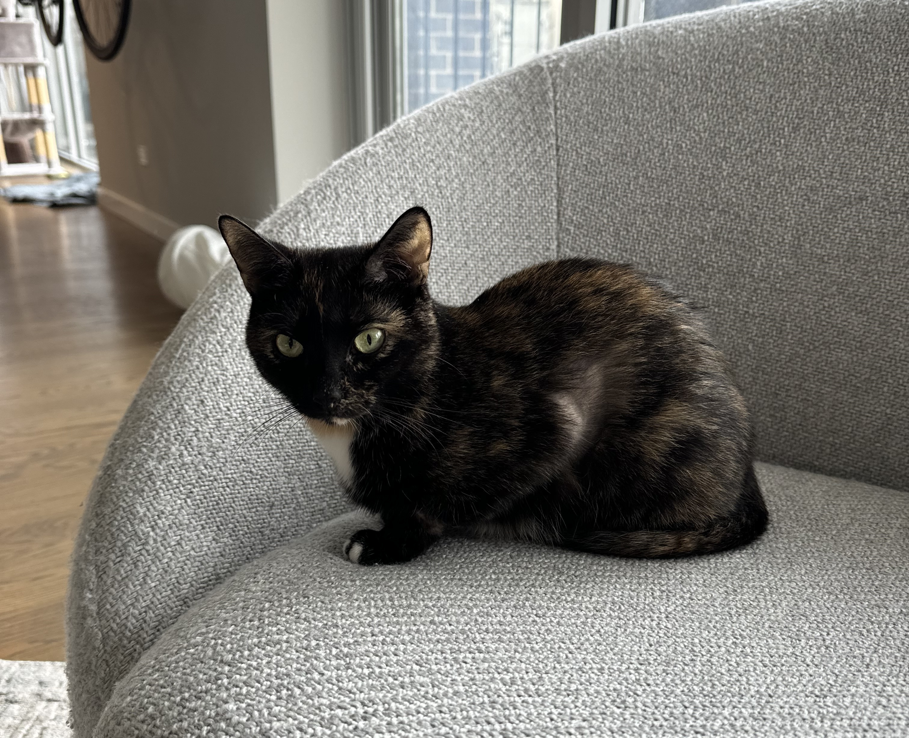

## slashslash.fish: Expanding // in commands

---

TL;DR: This is a fish plugin that lets you remap `//` or `foo//` (for arbitrary 'foo') to paths on disk. You can then enable this remapping logic for any command you'd like.

For now `//` will remap to:
- The root of your current git/sapling/hg repo (if you're in one)
- The root returned by `buck root` if you're in a buck workspace

If your git repo lives at `/home/foo/bar`, then no matter where you are within that repo `//` will map to `/home/foo/bar`. For example
```
> cd /home/foo/bar
> mkdir baz
> echo "meow" > baz/cat

> cd another/directory
> ls //baz/cat
../../baz/cat
> cat //baz/cat
meow
```

By default this expansion is enabled for the following commands: `cat`, `ls`, `cp`, `rm`, `mv`, `cd`, `zip`, `unzip`, `vim`, `nvim`, `vi`, `buck`, `sl`, `git`, `hg`, `grep`, `ack`

There's one special one too: `!!`. This command wraps `eval` so that you can expand arbitrary commands/args, e.g. within this repo the following works
```
> !! //bin/a.sh
hi
```

You get no warranty, good luck.

## Cells

### Global

You can define a global cell (meaning it exists no matter what your PWD is) via
``
ss cells -a new_cell /path/to/whatever
```
See `ss cells --help` for more info.

### Local

You can define local cells via dotfiles named `.ss`. The contents of each file should be of the form
```
cell_name : cell_path
cell_name2 : cell_path2
```
Each line defines a new cell. Each path can be relative, which will be resolved relative to the file's containing directory, or absolute.

You can optionally specify a priority, too by appending it to the end of the line after a space, e.g.
```
special_cell : special/path 10000
```
See `ss cells --help` for more info about priority.

### buck

In buck workspaces buck cells will also automatically expand. So e.g. if you have a cell defined `foobar = path/to/foobar` then `foobar//` will expand to `$WORKSPACE_ROOT/path/to/foobar`, where `$WORKSPACE_ROOT` is the absolute root of the buck repo (i.e. not the curernt cell's root).


## Installing

### Manual

Copy each of the contents of these folders into `~/.config/fish` (make sure to copy recursively)

### Fisher

I have now confirmed this workflow works, yay!
```
fisher install danzimm/slashslash.fish
```

## Configuration

### Defaults

### Disabling

You can disable any of these by editing `conf.d/slashslash.fish` directly or specifying
```
ss disable cmd1 cmd2 ...
```
to disable expansion for cmd1, cmd2, etc..

### Enabling
You can enable additional commands which have `//` expansion by calling `slashslash` without any flags
```
ss secret_command
ss enable secret_command_2
```

## Plugins

Want to expand `//` in more contexts? Follow what's done with `__slashslash_buck` in `conf.d/slashslash.fish`. Essentially you define a (portable, meaning it can run without any configs) function that prints out what cells are available. You then register that function with `ss plugin`. See `ss plugin --help` for more info.

## Motivation

In both buck (& bazel I think) there's a concept of a 'cell' which dictates the current "workspace" you're building from (this is helpful because e.g. each cell has its own configuration). When building/running things within buck you refer to the executable/test/library by a "target", e.g. of the form `cell//path/to:target` (henceforth referred to as a fully qualified target). The `cell` part is optional, and will default to most enclosing cell your $PWD is in.

This "qualified target" specification is also used when loading build files, e.g.
```
load("@cell//build/helper:super_useful.bzl", "magic")
```

I found it annoying to have to convert between the qualified target format & raw paths, so I created a layer in `fish` which will translate `//` into the right path based on your context. Within a buck repo `//` will map to `buck root` (so, in particular it will map to the current cell you're in) and `cell//` will map to the path for that cell (see e.g. `buck audit cell`).

## Roadmap

None, currently. Turns out this was a weekend project for me.

## Contributing

Please do! Glad to accept help, but will respond slowly as time permits. This is a side project, to the extreme.

## NAQBMBAIF

Stands for "Never Asked Questions But Might Be Asked In Future".

### Why only fish?

I don't use any other shell, and don't know if other shells have the required hooks

### Your code is bad

Yep, checks out. But hey, this isn't a question

### Will you support X?

Put up your request in an issue, maybe!

## Dedication

These scripts are dedicated to my cat Tippy. She unfortunately passed from lymphoma late 2024.


